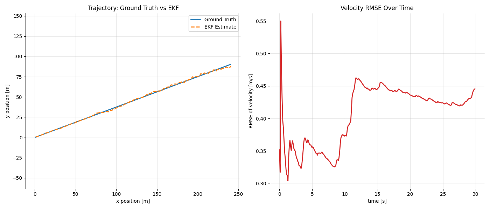

# Radar-Only Extended Kalman Filter (EKF) in C++17

This project implements a radar-only Extended Kalman Filter for 2D target tracking using C++17 and Eigen3.

The state is estimated in Cartesian coordinates while radar measurements are received in polar form:

- Range: $\rho$
- Bearing: $\phi$
- Range rate: $\dot{\rho}$

A synthetic simulation in `main.cpp` generates a straight-line moving target, adds Gaussian radar noise, runs the EKF, and logs Ground Truth vs Estimate into CSV.



## Project Structure

- `include/kalman_filter.h`: EKF class declaration
- `src/kalman_filter.cpp`: EKF implementation (Predict + Radar Update + Jacobian)
- `src/main.cpp`: simulation, noisy measurement generation, CSV logging, and RMSE printout
- `scripts/plot_results.py`: Matplotlib plotting script for trajectory and velocity RMSE
- `CMakeLists.txt`: CMake build definition
- `CMakePresets.json`: CMake configure/build presets

## Build Requirements

- CMake >= 3.14
- C++17 compiler
- Eigen3
- Python 3 with NumPy and Matplotlib (for plotting)

## Build and Run

### Option A: Standard CMake

```bash
cmake -S . -B build
cmake --build build
./build/radar_ekf
```

On Windows PowerShell:

```powershell
cmake -S . -B build
cmake --build build
.\build\radar_ekf.exe
```

### Option B: Presets

```bash
cmake --preset windows-msvc-debug
cmake --build --preset windows-msvc-debug
```

## Output

The executable writes:

- `ekf_log.csv` in the current working directory where the executable is run

If run from `build/`, your CSV will be at `build/ekf_log.csv`.

The console also prints the final combined velocity RMSE.

## Plotting

Install Python dependencies:

```bash
pip install numpy matplotlib
```

Run plotting script from project root:

```bash
python scripts/plot_results.py --csv build/ekf_log.csv
```

This generates two charts:

1. Ground Truth trajectory vs EKF estimated trajectory
2. Velocity RMSE over time

## EKF Math (Detailed)

### 1) State Vector

The filter tracks position and velocity in Cartesian coordinates:

$$
\mathbf{x} =
\begin{bmatrix}
p_x \\
p_y \\
v_x \\
v_y
\end{bmatrix}
$$

### 2) Motion Model (Constant Velocity)

For timestep $\Delta t$:

$$
\mathbf{x}_{k|k-1} = \mathbf{F}\,\mathbf{x}_{k-1|k-1}
$$

with

$$
\mathbf{F}=
\begin{bmatrix}
1 & 0 & \Delta t & 0 \\
0 & 1 & 0 & \Delta t \\
0 & 0 & 1 & 0 \\
0 & 0 & 0 & 1
\end{bmatrix}
$$

Covariance prediction:

$$
\mathbf{P}_{k|k-1}=\mathbf{F}\,\mathbf{P}_{k-1|k-1}\,\mathbf{F}^T + \mathbf{Q}
$$

Using acceleration noise $(\sigma_{a_x}^2,\sigma_{a_y}^2)$, process covariance is:

$$
\mathbf{Q}=
\begin{bmatrix}
	frac{\Delta t^4}{4}\sigma_{a_x}^2 & 0 & \tfrac{\Delta t^3}{2}\sigma_{a_x}^2 & 0 \\
0 & \tfrac{\Delta t^4}{4}\sigma_{a_y}^2 & 0 & \tfrac{\Delta t^3}{2}\sigma_{a_y}^2 \\
	frac{\Delta t^3}{2}\sigma_{a_x}^2 & 0 & \Delta t^2\sigma_{a_x}^2 & 0 \\
0 & \tfrac{\Delta t^3}{2}\sigma_{a_y}^2 & 0 & \Delta t^2\sigma_{a_y}^2
\end{bmatrix}
$$

### 3) Radar Measurement Model (Nonlinear)

Radar measurement:

$$
\mathbf{z}=
\begin{bmatrix}
\rho \\
\phi \\
\dot{\rho}
\end{bmatrix}
$$

Nonlinear mapping from state to radar space:

$$
\mathbf{h}(\mathbf{x})=
\begin{bmatrix}
\sqrt{p_x^2+p_y^2} \\
\operatorname{atan2}(p_y,p_x) \\
\dfrac{p_x v_x + p_y v_y}{\sqrt{p_x^2+p_y^2}}
\end{bmatrix}
$$

Innovation:

$$
\mathbf{y}=\mathbf{z}-\mathbf{h}(\mathbf{x}_{k|k-1})
$$

Bearing innovation is angle-normalized to $[-\pi,\pi]$.

### 4) Jacobian for EKF Update

Because radar model is nonlinear, EKF linearizes around current estimate using Jacobian:

$$
\mathbf{H}_j = \left.\frac{\partial \mathbf{h}}{\partial \mathbf{x}}\right|_{\mathbf{x}_{k|k-1}}
$$

Define:

$$
c_1 = p_x^2 + p_y^2,\quad c_2=\sqrt{c_1},\quad c_3=c_1 c_2
$$

Then:

$$
\mathbf{H}_j=
\begin{bmatrix}
\frac{p_x}{c_2} & \frac{p_y}{c_2} & 0 & 0 \\
-\frac{p_y}{c_1} & \frac{p_x}{c_1} & 0 & 0 \\
\frac{p_y(v_x p_y - v_y p_x)}{c_3} & \frac{p_x(v_y p_x - v_x p_y)}{c_3} & \frac{p_x}{c_2} & \frac{p_y}{c_2}
\end{bmatrix}
$$

### 5) Division-by-Zero Handling (Important)

If $c_1 = p_x^2 + p_y^2$ is very small, Jacobian terms include division by values near zero.

This implementation uses an epsilon guard:

- If $c_1 < 10^{-6}$, Jacobian returns zero matrix and prints a warning.
- During radar prediction, if $\rho < 10^{-6}$, $\rho$ is clamped to epsilon before dividing.

This avoids numerical instability and undefined behavior.

### 6) EKF Update Equations

With Jacobian in place:

$$
\mathbf{S}=\mathbf{H}_j\mathbf{P}_{k|k-1}\mathbf{H}_j^T + \mathbf{R}
$$

$$
\mathbf{K}=\mathbf{P}_{k|k-1}\mathbf{H}_j^T\mathbf{S}^{-1}
$$

$$
\mathbf{x}_{k|k}=\mathbf{x}_{k|k-1}+\mathbf{K}\mathbf{y}
$$

$$
\mathbf{P}_{k|k}=(\mathbf{I}-\mathbf{K}\mathbf{H}_j)\mathbf{P}_{k|k-1}
$$

Radar measurement covariance used in this project:

$$
\mathbf{R}=\begin{bmatrix}
0.09 & 0 & 0 \\
0 & 0.0009 & 0 \\
0 & 0 & 0.09
\end{bmatrix}
$$

## RMSE Metric Used

The simulation computes combined velocity RMSE:

$$
\mathrm{RMSE}_v = \sqrt{\frac{1}{N}\sum_{k=1}^{N}\left[(\hat v_{x,k}-v_{x,k})^2 + (\hat v_{y,k}-v_{y,k})^2\right]}
$$

The plotting script also shows a cumulative RMSE-over-time curve.

## Notes

- The first measurement initializes position and velocity using radar-to-Cartesian projection.
- Initial velocity uncertainty is intentionally high (`P0(2,2)=P0(3,3)=500`) to let measurements quickly correct velocity.
- For better real-world behavior, tune process noise (`noise_ax`, `noise_ay`) and measurement noise (`R`).